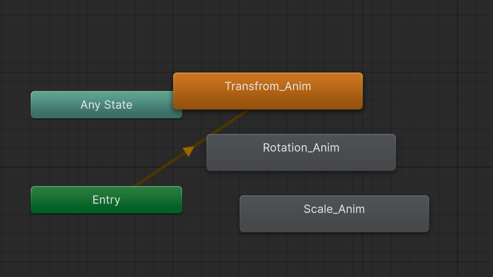
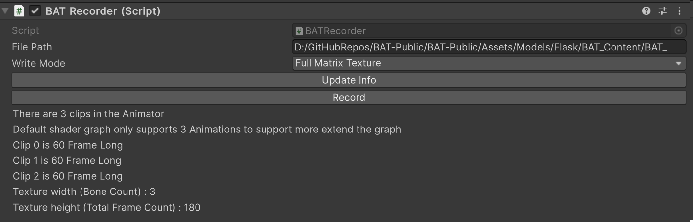
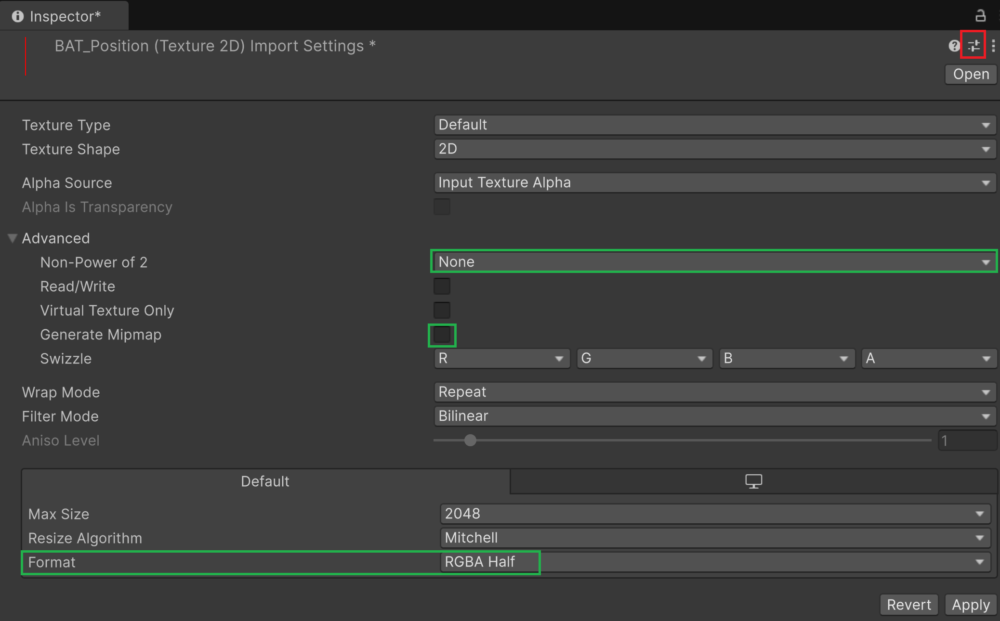
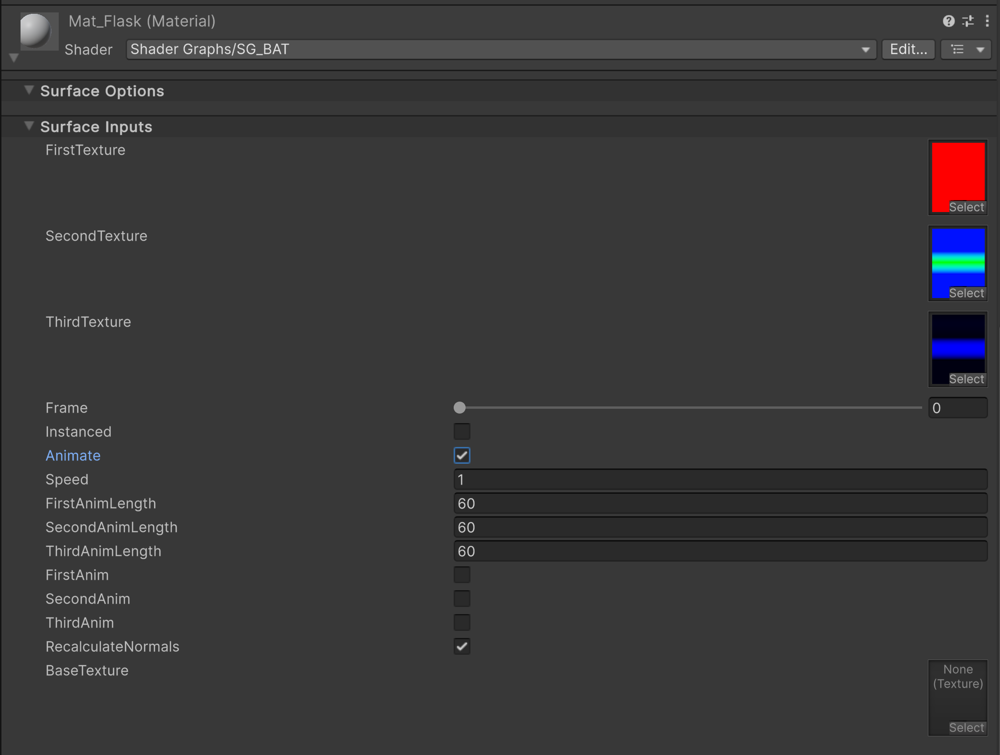

# BONE ANIMATION TEXTURE (BAT) 

Inspired by VAT (Vertex Animation Textures), which are traditionally used to run animations exclusively on the GPU by recording the movement of each vertex of a mesh in a texture and then reading from it, BAT is an optimized version of VAT. Instead of baking the transformation of each vertex in your animation, BAT records only the transformation of the bones in your animation. This results in much smaller textures and lower memory usage, while maintaining the same quality as VAT.

## Advantages Compared to VAT:
1. **Smaller Textures** : BAT produces significantly smaller textures.

2. **LOD Sharing Across Multiple Levels** : 
BAT is independent of the vertex count of your mesh and can be shared across multiple LOD (Level of Detail) levels. For example, in a crowd simulation, you would typically need different meshes with varying LOD levels, and using VAT would require baking unique textures for each LOD level, as each level has a different vertex count. However, with BAT, you only need one set of textures for your animation, because the bone hierarchy remains consistent across multiple LOD levels of your character, making your animation independent of the vertex count.

## Downsides Compared to VAT:
A key limitation of BAT is that it requires a skinned mesh with a bone hierarchy. This makes it incompatible with simulations that lack a bone structure, such as fluid or cloth simulations.

However, tools like Dem Bones, an open-source library for skinning decomposition, can convert arbitrary animated mesh sequences into skinned models with bone transformations. This allows you to preprocess simulations like cloth or muscle animations and make them compatible with BAT.

For more details, visit the Dem Bones repository: https://github.com/electronicarts/dem-bones.

## How it works    
The tool consist of two parts:

### C# Script - BATRecorder.cs :
This script writes the full transform matrix of each bone in your animation into three different textures, each with four channels. (Each row of the matrix takes up four channels across the three textures.) If you would like to debug the matrix values, there is an option to print the values to a CSV file, which makes them easier to read.

### Shader Graph - SG_BAT :
This shader graph decodes the textures and performs linear blend skinning on the mesh, based on the transformations of each bone and the bone weights stored in the mesh.

### Important Setup for Shader Graph:
For the Shader Graph to work properly with your setup, you need access to bone weights and bone indices of the mesh within the Shader Graph.
These properties are not available by default and require you to modify the Shader Graph package.
_If you clone this repository, this step has already been completed for you. No further action is required._

#### Follow these steps to enable this:
1. Embed the Shader Graph package:
   1. Copy the Shader Graph package folder from the Library/PackageCache directory in your project.
   2. Paste it into the Packages directory of your project. This will make the package editable.
2. Add the following files to the _com.unity.shadergraph/Editor/Data/Nodes/Input/Geometry_ folder:
    1. [BoneWeightNode.cs](Packages/com.unity.shadergraph/Editor/Data/Nodes/Input/Geometry/BoneWeightNode.cs)
    2. [BoneIndexNode.cs](Packages/com.unity.shadergraph/Editor/Data/Nodes/Input/Geometry/BoneIndexNode.cs)
## How to use  
1. Have a skinned mesh model ready and prepare the animation clips you want to bake.
2. Create an Animator Controller and drag and drop all the animation clips into it.

   1. The order of dropping clips will be the order they will be recorded.
   2. You do not need to create a state machine; having the clips in the Animator Controller is enough.
   3. By default, the shader graph supports up to 3 animations. If you need to record more, you will need to extend the graph.
3. Attach the BATRecorder.cs script to your GameObject. 
4. Press the **Update info** button to refresh the information 

   1. You can modify the path that you want to save your textures here
   2. The printed information shows you the number of recorded clips and length of each, which will be used in the Shader Graph. 
   3. It also shows you the texture size, that the width of your texture equals the bone count of your animation and the height equals the total frame count of all your clips combined.
5. Press the **Record** Button !
6. Find your textures in the project and apply the setting in the **BAT_Texture_Preset** to them:

   1. The preset ensures the texture is 
      1. **Non-Power** of 2 is None
      2. **Generate Mip Maps** is Unchecked
      3. **Format** is RGBA HALF

7. Find the mesh of your model and drag and drop it into the scene 
   1. make sure the component attached to your GameObject is a regular **Mesh Renderer** not **Skinned Mesh Renderer** 
8. Find **SG_BAT** Shader Graph and attach it to your GameObject
   1. Use the values from the BATRecorder.cs script for filling the Shader Graph fields.

9. Now you can render a large number of animated characters using your preferred method.
You can use VFX Graph, DOTS, your custom script with explicit draw calls, or instantiate them as GameObjects.

   
### References:
Similar technique have been used in this [Austin demo](https://github.com/Unity-Technologies/UniteAustinTechnicalPresentation)
(only two bone influence per vertex and no Shader graph and URP support) 
